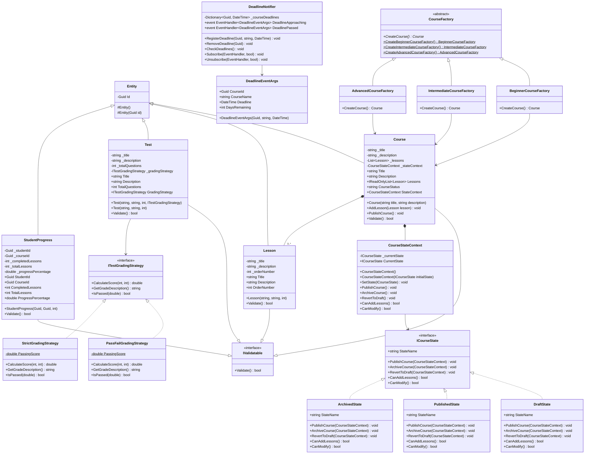

# LmsPlatform - UML Class Diagram

## Architecture Overview
Comprehensive UML Class Diagram representing the LmsPlatform domain layer with implemented design patterns: State, Strategy, Observer, and Factory.

## Design Patterns Implemented

### 1. **State Pattern** (State Folder)
- **Context**: `CourseStateContext`
- **States**: `DraftState`, `PublishedState`, `ArchivedState`
- **Interface**: `ICourseState`
- Manages course lifecycle through state transitions

### 2. **Strategy Pattern** (Strategy Folder)
- **Context**: `Test` class
- **Strategy Interface**: `ITestGradingStrategy`
- **Implementations**: `PassFailGradingStrategy`, `StrictGradingStrategy`
- Dynamically switches grading algorithms

### 3. **Observer Pattern** (Observer Folder)
- **Subject**: `DeadlineNotifier`
- **Events**: `DeadlineApproaching`, `DeadlinePassed`
- **Event Args**: `DeadlineEventArgs`
- Notifies subscribers about deadline changes

### 4. **Factory Pattern** (Factory Folder)
- **Abstract Factory**: `CourseFactory`
- **Concrete Factories**: `BeginnerCourseFactory`, `IntermediateCourseFactory`, `AdvancedCourseFactory`
- Creates pre-configured course instances

## Key Relationships

- **Inheritance**: All entities inherit from `Entity` base class
- **Interface Implementation**: Validatable entities implement `IValidatable`
- **Composition**: Course contains multiple Lessons
- **Aggregation**: Course uses CourseStateContext
- **Dependency Injection**: Test uses ITestGradingStrategy
